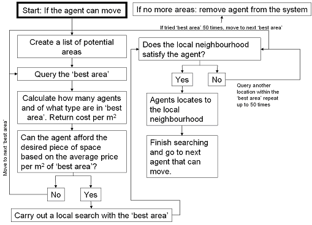
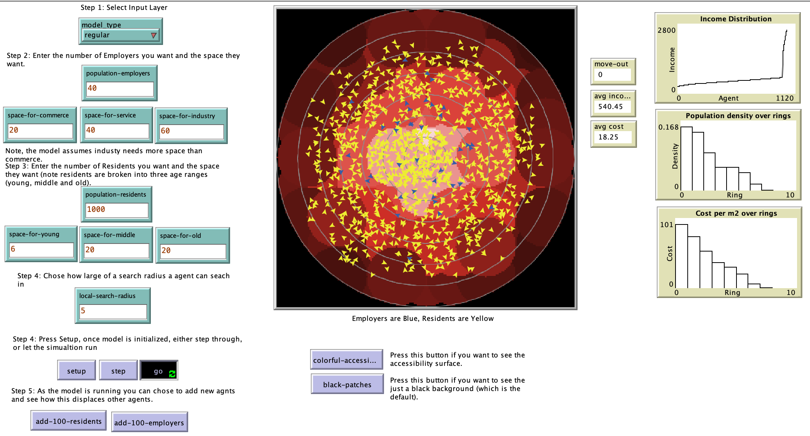

# A Bid Rent Model

## Introduction
 
This is a rough implementation of Alonso’s (1964) Bid rent model. Where agents complete for space and land rents emerge. However, unlike the original model, here the land rents evolve and change over time as agents compete for locations. To some extent this is a reimplementation of the model developed in Repast by Crooks (2007). Further details about this model can be found at <https://sites.google.com/site/crooksphd/>.

Further information about the model can be seen in the "Info" Tab of the NetLogo model

## References
**Alonso, W. 1964.** Location and Land Use: Toward a General Theory of Land Rent. Cambridge, MA: Harvard University Press.

**Crooks, A. T. 2007.** “Experimenting with Cities: Utilizing Agent-Based Models and GIS to Explore Urban Dynamics.” PhD Thesis, University College London.

## &nbsp;
Basic model logic:

The NetLogo Graphical User Interface of the Model: 

Click on the image below to see a movie of a simulation:
 

## &nbsp;

**Version of NetLogo**: NetLogo 6.1.0.

